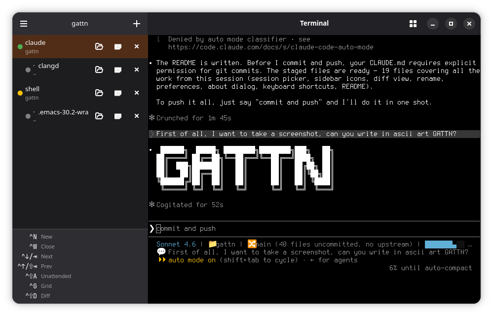

# gattn

Attention-grabbing session manager for agentic programming on GNOME.

Inspired by [attn](https://github.com/victorarias/attn).

Monitors multiple Claude Code sessions in a sidebar, highlights when one needs your attention, and lets you switch between them without leaving the keyboard.



## Run

```sh
nix run github:mmxgn/gattn
```

## Develop

```sh
nix develop
meson setup build && ninja -C build && ./build/gattn
```

## Requirements

GTK 4 · libadwaita · VTE (gtk4 variant)
