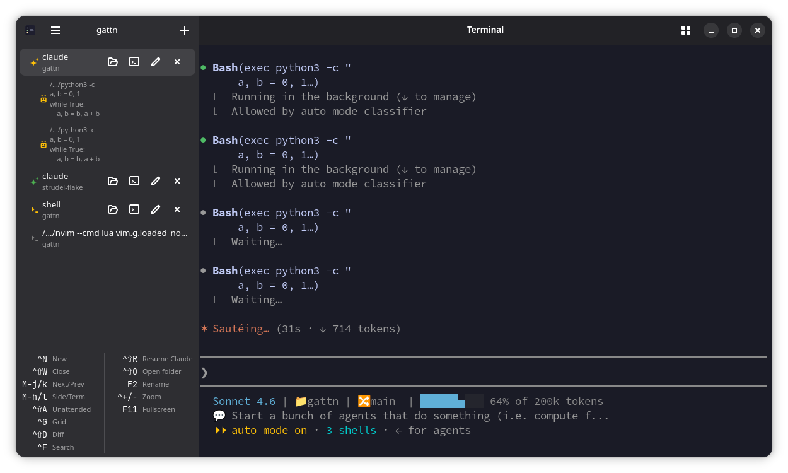
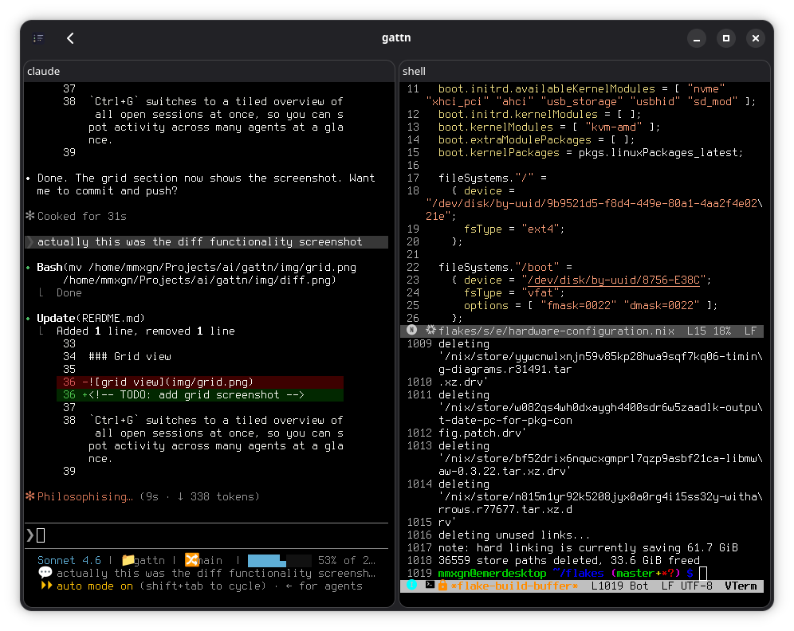
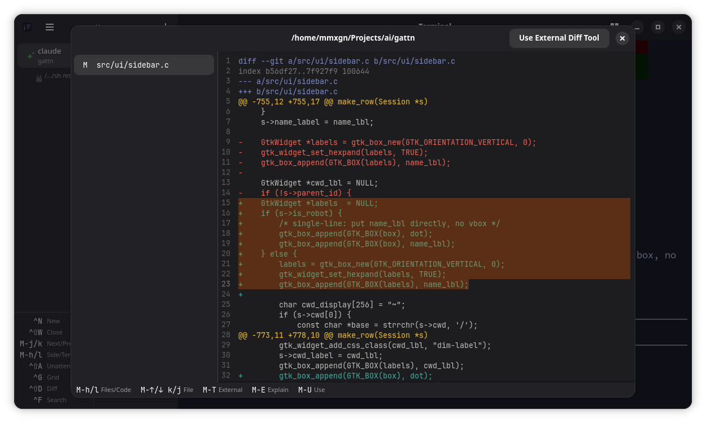

<p align="center"></p>

# gattn

Attention-grabbing session manager for agentic programming on GNOME.

Inspired by [attn](https://github.com/victorarias/attn).

Monitors multiple Claude Code sessions in a sidebar, highlights when one needs your attention, and lets you switch between them without leaving the keyboard.



## Features

### Attention grabbing

Session dots in the sidebar change colour as state changes:

| Colour | State | Meaning |
|---|---|---|
| Gray | Idle | Waiting, no action needed |
| Orange | Working | Actively running / busy |
| Green | Needs input | Waiting at a prompt for your next command |
| Red | Blocked | Paused on a question or permission prompt — needs a decision now |
| Blue | Done | Process has exited |

`Ctrl+Shift+A` jumps to the next session that needs attention, prioritising blocked (red) sessions over ones simply waiting at a prompt (green).

When gattn is not in focus, a desktop notification fires so you know exactly which session needs you without watching a terminal.

### Keyboard-only navigation

Everything is reachable without a mouse:

| Shortcut | Action |
|---|---|
| `Ctrl+N` | New session |
| `Ctrl+Shift+W` | Close session |
| `Ctrl+Shift+R` | Resume latest Claude session in current directory |
| `Ctrl+Tab` / `Ctrl+Shift+Tab` | Next / previous session |
| `Alt+↑` / `Alt+↓` or `Alt+K` / `Alt+J` | Previous / next session |
| `Alt+←` / `Alt+→` or `Alt+H` / `Alt+L` | Focus sidebar / terminal |
| `Ctrl+PgUp` / `Ctrl+PgDn` | Jump to first / last session |
| `Ctrl+Shift+A` | Jump to next unattended session (blocked first, then needs-input) |
| `F2` | Rename session |
| `Ctrl+F` | Search / filter sessions |
| `Ctrl+G` | Toggle grid view |
| `Ctrl+Shift+D` | Show diff |
| `Ctrl++` / `Ctrl+-` / `Ctrl+0` | Zoom in / out / reset terminal font |
| `Ctrl+Shift+C` / `Ctrl+Shift+V` | Copy selection / paste into the terminal |
| `F11` | Fullscreen |

**In the diff dialog:**

| Shortcut | Action |
|---|---|
| `Alt+H` / `Alt+←` | Focus file list |
| `Alt+L` / `Alt+→` | Focus source view |
| `Alt+K` / `Alt+↑` | Previous file |
| `Alt+J` / `Alt+↓` | Next file |
| `Alt+E` | Explain diff in Claude |
| `Alt+U` | Use diff in Claude prompt |
| `Alt+T` | Open in external diff tool |

### Grid view



`Ctrl+G` switches to a tiled overview of all open sessions at once, so you can spot activity across many agents at a glance.

### Diff

`Ctrl+Shift+D` (or the git icon in the sidebar) runs `git diff HEAD` in the session's live working directory and shows the result with syntax highlighting — red for deletions, green for additions.



<!-- TODO: explain / reuse buttons — open the diff in Claude to get an explanation or paste it into a new session -->

### Sub-agent monitoring

When a Claude session spawns sub-agents (parallel tasks), they appear indented under their parent in the sidebar with a robot icon. Their state dots follow the same colour scheme. Long executable paths are shortened to `/.../name` to keep the sidebar readable. Sub-agents that block on a question turn red, making it easy to spot which one needs a decision — use `Ctrl+Shift+A` to jump straight to it.

## Install

Grab the latest asset from the [releases page](https://github.com/mmxgn/gattn/releases/latest).

**AppImage**
```sh
chmod +x gattn-*.AppImage && ./gattn-*.AppImage
```

**Ubuntu / Debian**
```sh
sudo apt install ./gattn_*.deb
```

**Fedora**
```sh
sudo dnf install ./gattn-*.rpm
```

**Nix**
```sh
nix run github:mmxgn/gattn
```

## Develop

```sh
nix develop
meson setup build && ninja -C build && ./build/gattn
```

## Requirements

GTK 4 · libadwaita · VTE (gtk4 variant) · GtkSourceView 5
